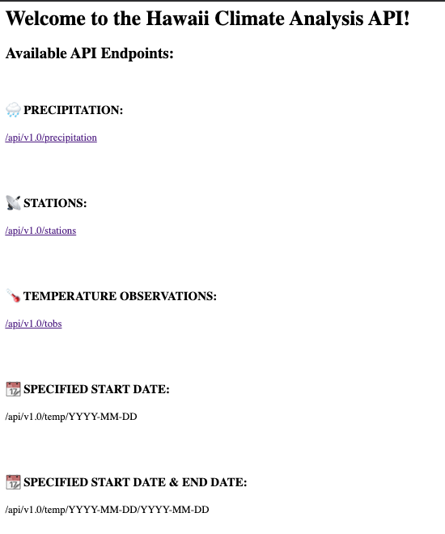

# SQLAlchemy_Challenge

## Table of Contents
1. Background
2. File Description
3. Technologies

## Background

Surfs Up!

In this challenge, we're on vacation in Honolulu, Hawaii! In order to plan ahead, we're to conduct analysis of percipation and climate stations with the use. We're then going to use said information to create a Flask API. App will be used to generate: average percipitation per day, climate stations, temp. observation after for most active station, along with the min, max, and avg readings within a given period.

Final Solution:

## File Descriptions

File name: hawaii_measurements.csv

Composed of 4 columns:

- Station
- Date
- Prcp
- Tobs

File name: hawaii_stations.csv

Composed of 5 columns:

- Station
- Name
- Latitude
- Longitude
- Elevation

File name:hawaii.sqlite

Composed of 2 tables, containing data within previously mentioned CSVs.

## Technologies

Scripts were created using Python (Version 3.8.8) in Visual Studio Code (Version: 1.60.1), along with Jupyter Notebook (Version 6.3.0). 

Applied use of: 

- Matplotlib
- Numpy
- Pandas
- Datetime
- Flask
- SQLAlchemy
